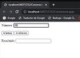

# SOAP PHP Application

This is a simple SOAP-based application implemented in PHP. The service exposes a basic operation (addition), and the client communicates with the server via SOAP.

## Requirements

Before running the application, make sure you have the following:

- PHP 7.0 or higher
- Apache or any web server with PHP support
- Docker (optional, for running the application inside a container)

## Installation and Running

### Option 1: Run Locally

1. Clone this repository to your local machine:

    ```bash
    git clone https://github.com/JordinPinzon/soap-php.git
    cd soap-php
    ```

2. Place the `service.wsdl` file in the web server's document root, or configure it to point to the correct location (e.g., `/var/www/html/service.wsdl`).

3. Set up the Apache web server to serve the PHP files (`index.php`, `server.php`). You can use XAMPP, WAMP, or your own Apache server.

4. Start the web server (Apache) and navigate to `http://localhost/service.wsdl` to confirm the WSDL file is accessible.

5. Run the PHP SOAP server:

    ```bash
    php -S localhost:8081
    ```

    The service will be available at `http://localhost:8081/server.php`.

## Results
<p align="center">
  
</p>
